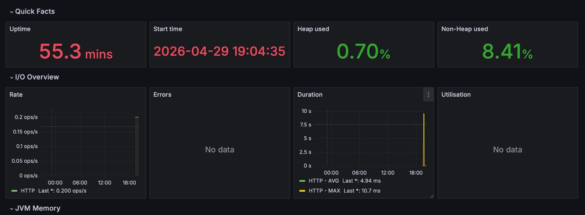
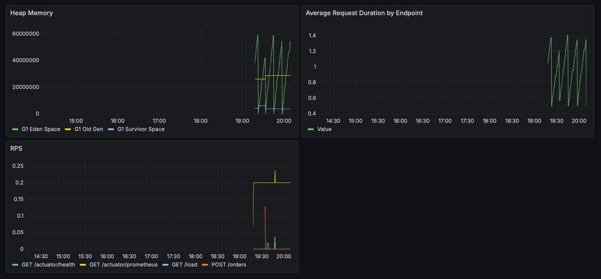

## Описание проекта

CRUD сервис для управления заказами с использованием Spring Boot и in-memory базы данных H2.

### Функциональность:
- Создание, чтение, обновление, удаление заказов 
- Эндпоинт /load для создания искусственной нагрузки 
- Логирование всех уровней (TRACE, DEBUG, INFO, WARN, ERROR)
- Тесты с покрытием >50%
- Сбор метрик через Actuator и Prometheus
- Визуализация в Grafana
- CI/CD пайплайн в GitHub Actions
- Docker контейнеризация
- 
## Запуск проекта

### В IntelliJ IDEA
1. Открыть проект в IDEA
2. Запустить класс `OrderApplication`
3. Приложение доступно на `http://localhost:8080`

### В Docker
# Собрать jar
./mvnw clean package

# Собрать Docker образ
docker build -t order-service .

# Запустить контейнер
docker run -p 8080:8080 order-service

### Thread dump

**Дата снятия:** 2026-04-29 11:25:44
**Всего потоков:** 27
**Файл:** dump.txt

**Топ-3 потока по нагрузке:**

| Название потока | elapsed (сек) | cpu_ms (ms) | Процент нагрузки |
|----------------|---------------|-------------|------------------|
| http-nio-8080-exec-1 | 35.80 | 2377.42 | 6.64% |
| DestroyJavaVM | 35.76 | 1749.81 | 4.89% |
| C1 CompilerThread0 | 37.60 | 190.21 | 0.51% |

- Формула: (cpu_ms / (elapsed × 1000)) × 100%
- (2377.42 / 35800) × 100% = 6.64%

**Анализ:**
- **http-nio-8080-exec-1**: Находится в состоянии RUNNABLE, выполняет метод heavyLoad() с 2 млд итераций Math.sqrt(). В момент снятия дампа активно утилизирует CPU.
- **DestroyJavaVM**: Системный поток, накопил CPU время при старте JVM.
- **C1 CompilerThread0**: JIT-компилятор, оптимизирует горячий код.

### Heap dump

**Файл:** heap_dump.hprof  
**Размер:** 56 112 320 байт (~53.5 MB)  
**JVM Uptime:** 0 мин 17 сек

| Параметр | Значение |
|----------|----------|
| Heap Size | 26 491 856 B (~25.3 MB) |
| Classes | 15 725 |
| Instances | 513 846 |
| Classloaders | 7 |
| GC Roots | 3 571 |
| Объекты в финализации | 0 |

**Анализ heap dump:**
- Размер heap (25 MB) соответствует норме для Spring Boot приложения с бд H2
- 513000 объектов - стандартное количество для Spring Boot
- Объекты в финализации = 0 свидетельствует об отсутствии утечек памяти

##### Мониторинг (Prometheus + Grafana)

**Импортированный дашборд JVM:**

**Собственный дашборд :**

### PromQL запросы

| № | Название панели | PromQL запрос | Какие метрики выводит                                                                                                                                                                                                                                            |
|---|----------------|---------------|------------------------------------------------------------------------------------------------------------------------------------------------------------------------------------------------------------------------------------------------------------------|
| 1 | Среднее время запросов по URL | sum by (uri) (rate(http_server_requests_seconds_sum[5m])) / sum by (uri) (rate(http_server_requests_seconds_count[5m])) | http_server_requests_seconds_sum - общее время обработки всех запросов к каждому URL за 5 минут; http_server_requests_seconds_count - количество запросов к каждому URL за 5 минут. Панель показывает среднее время ответа для каждого эндпоинта отдельно. |
| 2 | RPS (запросов в секунду) | rate(http_server_requests_seconds_count[1m]) | http_server_requests_seconds_count - количество HTTP запросов. Панель показывает сколько запросов в секунду обрабатывает приложение за последнюю минуту.                                                                                                         |
| 3 | Использование heap памяти | jvm_memory_used_bytes{area="heap"} | jvm_memory_used_bytes - количество используемой памяти JVM в области heap. Панель показывает текущее потребление памяти в байтах.                                                                                                                                |